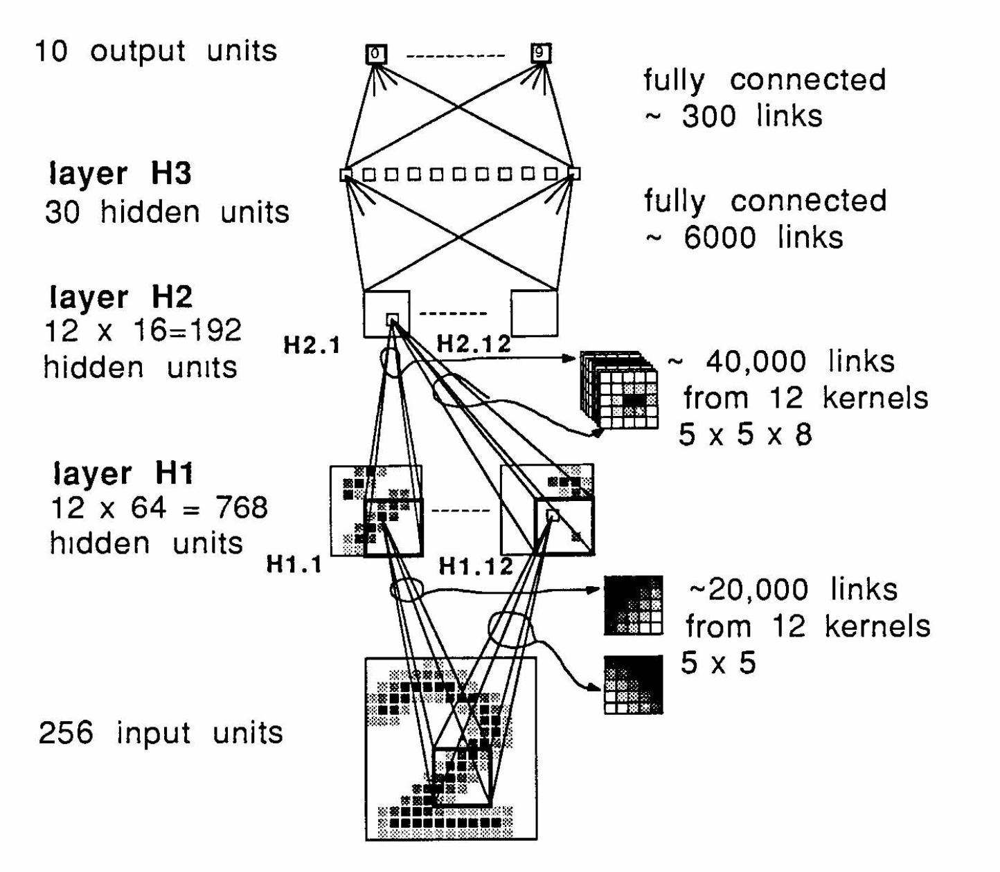
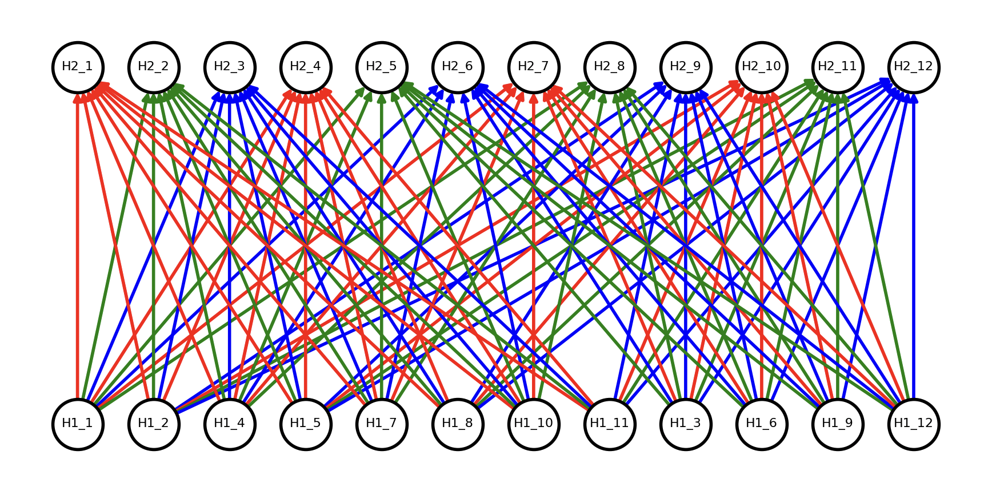
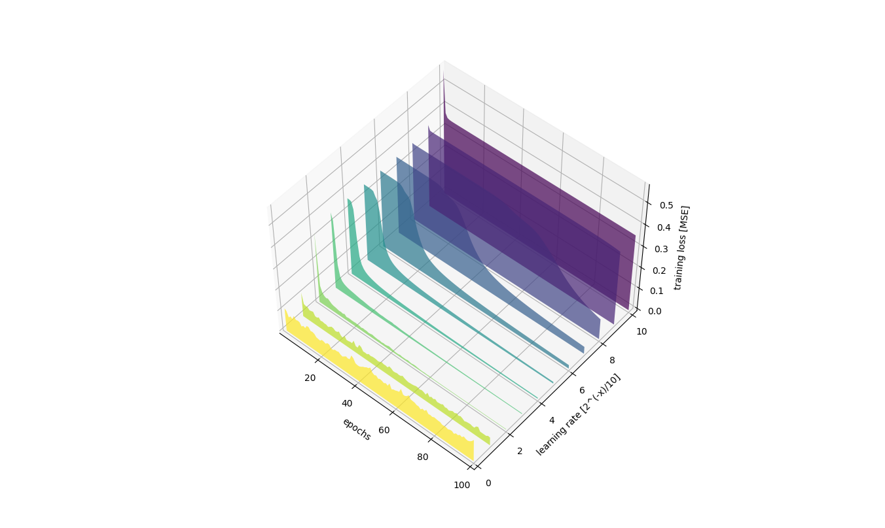
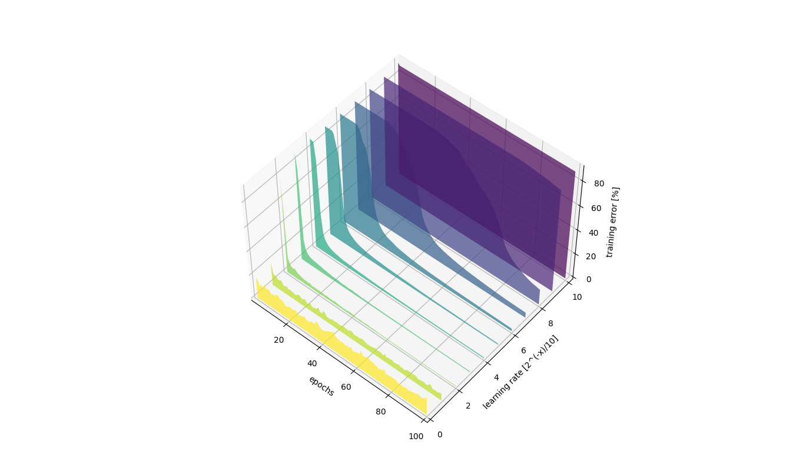

# Backpropagation Applied to Handwritten Zip Code Recognition
- LeCun, Y., 1989. Backpropagation Applied to Handwritten Zip Code Recognition, Neural computation 1 (4), 541-551. http://yann.lecun.com/exdb/publis/pdf/lecun-89e.pdf
- MNIST. http://yann.lecun.com/exdb/mnist/

C implementation of the architecture described in the paper. Converges well, though distinctly from the case described in the paper. This is most likely caused by:
- difference in bias initialization: this implementation initializes biases as zeros while paper doesn't specify.
- difference in learning rate: although I've did parameter sweep covering learning rates in range of [2**(-n)/10 for n in range(12)] (1.25e-2 giving the best results) it could still differ from original implementation
- difference in dataset: original implementation used MNIST predecessor of smaller size (7,291 : 2,007 train/test split) that I couldn't track down (MNIST has 60,000 training cases and 10,000 test cases), instead subset of MNIST is used matching original training / test data split. I suspect images are of better quality. They were resized from 28x28 pixels to 16x16 pixels accepted by the described architecture.



Each H2 layer runs its 12x filters on selected 8x H1 layers (their outputs aka. feature maps). Paper doesn't cover H1 -> H2 connection scheme - "The eight maps in H1 on which a map in H2 takes its inputs are chosen according a scheme that will not be described here." :( 
This implementation ensures equal propagation of H1 outputs, as demonstrated here:



## Results
After 23 epochs the lowest error rate on the test set was achieved using learning rate of 1.25e-2:
- 2.83% [training error]
- 5.33% [test error]
- 2.06e-2 [training loss]
- 3.64e-2 [test loss]

Results claimed in paper are:
- 0.14% [training error]
- 5.00% [test error]
- 2.5e-3 [training loss]
- 1.8e-2 [test loss]

Best results after 100 epochs and with learning rate of 3.125e-3:
- 1.02% [training error]
- 4.53% [test error]
- 8.25e-3 [training loss]
- 2.98e-2 [test loss]

This is close enough in scope of test metrics, but much lower training loss / error is confusing. Seems like original model overfitted in just 23 epochs suggesting difference in implementation. Based on my observations overfitting that fast is not possible no matter the learning rate - at higher learning rates model won't be able to reach the global minimum for training loss, at lower learning rates it will be simply converging too slow to overfit in 23 epochs. See following plots and data in log.csv file:




I suspect the cause might lie in initialization of weights or in "special version of Newton's algorithm that uses a positive, diagonal approximation of the Hessian matrix" - might investigate some more one day.

## Running
```
wget http://yann.lecun.com/exdb/mnist/train-images-idx3-ubyte.gz
wget http://yann.lecun.com/exdb/mnist/train-labels-idx1-ubyte.gz
gzip -dv train-images-idx3-ubyte.gz
gzip -dv train-labels-idx1-ubyte.gz

cmake .
make -j
./lecun train-images-idx3-ubyte train-labels-idx1-ubyte
```
```
...
Epoch: 29

Avg loss training set [MSE]: 0.015938
Misclassified patterns training set: 2.02%

Avg loss test set [MSE]: 0.036277
Misclassified patterns test set: 5.43%
...
```
