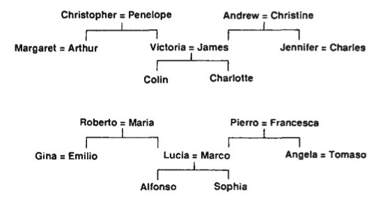

# Learning representations by back-propagating errors
- Rumelhart, D.E., Hinton, G.E. and Williams, R.J., 1986. Learning representations by back-propagating errors. nature, 323(6088), pp.533-536. http://www.cs.utoronto.ca/~hinton/absps/naturebp.pdf
- Hinton, G.E., 1986, August. Learning distributed representations of concepts. In Proceedings of the eighth annual conference of the cognitive science society (Vol. 1, p. 12). https://www.cs.toronto.edu/~hinton/absps/families.pdf 

Attempt at implementing examples provided in the *Learning representations by back-propagating errors*:
- Example from Fig. 1 - "detecting mirror symmetry in vectors"
- Example from Fig. 2, 3 & 4 - "predicting third term in triples of two isomorphic family trees"

## Detecting mirror symmetry in vectors
This example works fine with just one caveat - it does not always converge based on the recipe from the paper. Success depends on lucky initialization of weights. It doesn't take much to come across lucky initialization but sometimes it requires few attempts. If it works it works 100%.
```
python3 main.py symmetry
```
## Predicting third term in triples of two isomorphic family trees
This example doesn't work as described in the paper(s). Allegedly network should converge to the state where predictions on training set are accurate - ~0.8 values at output units corresponding to the correct third term of a given triple and ~0.2 values at the output units not matching the third term. Also a decent generalization should happen for test cases where output units correct for the given triple should reach values of ~0.5, while the remaining units should stay at ~0.2. This is not happening - instead network learns to mimic distribution of third terms across the whole training set - always returning same values from every output unit no matter the input units' values:
```
Sweep 171/1500; total error: 51.411514702972156; time: 2.6 sec
  train predictions [en]:
    Christopher's daughter is: [('Colin', 0.2046), ('Margaret', 0.1987), ('Francesca', 0.1986)]; least likely: [('Maria', 0.1601), ('Christine', 0.1635), ('Sophia', 0.1717)]
    Colin's uncle is: [('Colin', 0.2049), ('Margaret', 0.199), ('Francesca', 0.1989)]; least likely: [('Maria', 0.1603), ('Christine', 0.1638), ('Sophia', 0.1719)]
  train predictions [it]:
    Sophia's aunt is: [('Colin', 0.2049), ('Margaret', 0.1989), ('Francesca', 0.1988)]; least likely: [('Maria', 0.1603), ('Christine', 0.1637), ('Sophia', 0.1718)]
    Gina's nephew is: [('Colin', 0.2046), ('Margaret', 0.1987), ('Francesca', 0.1986)]; least likely: [('Maria', 0.1601), ('Christine', 0.1635), ('Sophia', 0.1716)]
  test predictions [en]:
    Jennifer's husband is: [('Colin', 0.2047), ('Margaret', 0.1987), ('Francesca', 0.1986)]; least likely: [('Maria', 0.1601), ('Christine', 0.1636), ('Sophia', 0.1717)]
    Margaret's nephew is: [('Colin', 0.2046), ('Margaret', 0.1987), ('Francesca', 0.1985)]; least likely: [('Maria', 0.16), ('Christine', 0.1635), ('Sophia', 0.1716)]
  test predictions [it]:
    Angela's niece is: [('Colin', 0.2046), ('Margaret', 0.1986), ('Francesca', 0.1985)]; least likely: [('Maria', 0.16), ('Christine', 0.1634), ('Sophia', 0.1716)]
    Francesca's son is: [('Colin', 0.2046), ('Margaret', 0.1987), ('Francesca', 0.1986)]; least likely: [('Maria', 0.1601), ('Christine', 0.1635), ('Sophia', 0.1716)]
```
Loss stagnates at value of approx. 50 and further sweeps (epochs) don't help.

In an attempt to train on just 3 triples, this happens:
```
Sweep 271/1500; total error: 0.7267751155173348; time: 0.04 sec
  train predictions [en]:
    Arthur's father is: [('Christopher', 0.6617), ('Andrew', 0.3388), ('Maria', 0.2)]; least likely: [('Jennifer', 0.1989), ('Victoria', 0.199), ('Lucia', 0.1991)]
    James's father is: [('Christopher', 0.6617), ('Andrew', 0.3388), ('Angela', 0.2)]; least likely: [('Jennifer', 0.1989), ('Victoria', 0.199), ('Lucia', 0.1991)]
    Victoria's father is: [('Christopher', 0.6617), ('Andrew', 0.3388), ('Angela', 0.1999)]; least likely: [('Jennifer', 0.1989), ('Victoria', 0.199), ('Charles', 0.1991)]
```
Clearly, network minimizes loss by mimicking output probabilities across the whole set and disregards signal from input. 

These ideas have been tried:
- multiple runs to come across lucky weights initialization - never happened
- changing range of weights initalization from -0.3 <> 0.3 to e.g. -1.0 <> 1.0 - didn't help
- changing encoding of input from [0.0, 1.0] to [-1.0, 1.0] - no difference
- adding biases (not mentioned in paper that they are present but tried this nonetheless) - no effect
- chaning epsilon and alpha parameters, disabling weight decay, disabling [0.2, 0.8] activation cut-off - nothing

```
python3 main.py family
```

Please contact me through github or at lyre_embassy_0n@icloud.com if you know the solution or have some idea worth trying. Thank you!

Another discrepancy from paper is that number of possible triples in two isomorphic families described appears to be 112 as opposed to claimed 104. I've decided to keep using 4 cases for test of generalization while spending remaining 108 cases on training.



Chris, Penelope, Andrew, Christine:
- spouse
- son
- daughter

= 12 triples

Margaret, Charles
- spouse
- nephew
- niece

= 6 triples

Arthur, Jennifer
- spouse
- father
- mother
- sister / brother
- nephew
- niece

= 12 triples

Victoria, James
- spouse
- father
- mother
- son
- daughter
- brother / sister

= 12 triples

Colin / Charlotte
- father
- mother
- uncle x2
- aunt x2
- brother / sister

= 14 triples
= 56 triples in total * 2 nationalities = 112

Apparently an error in the paper.
